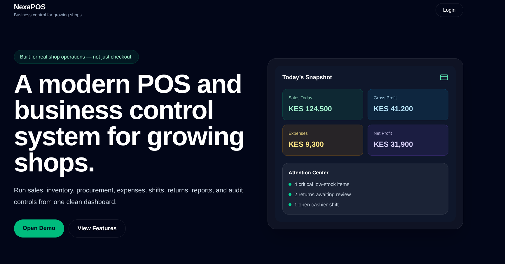
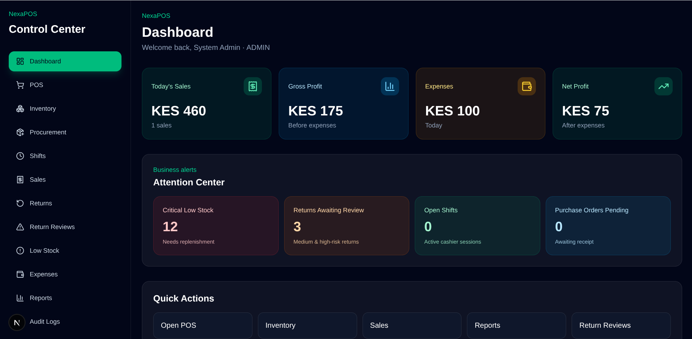
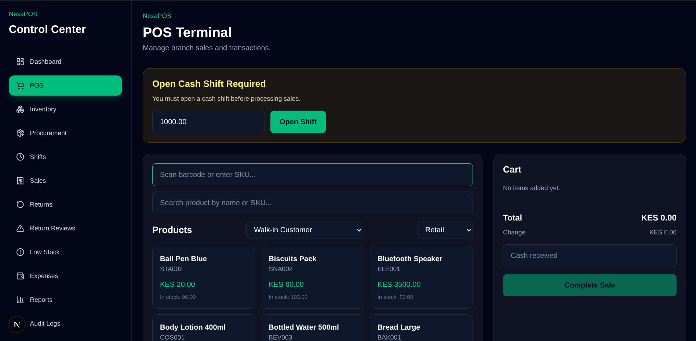
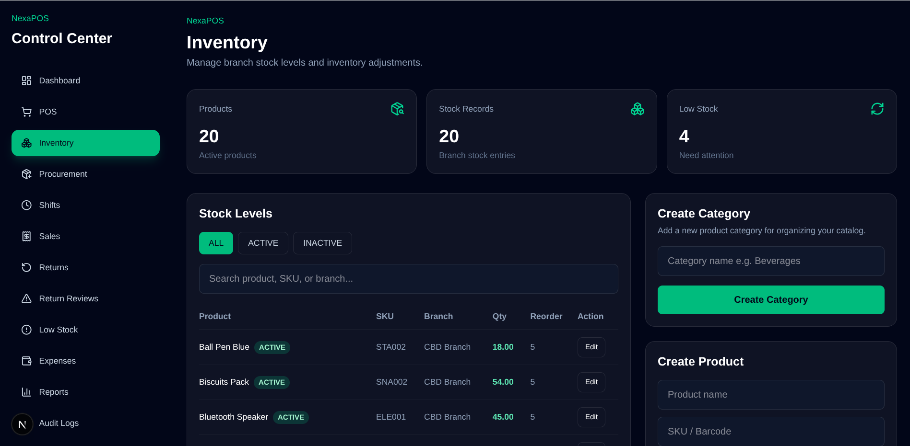
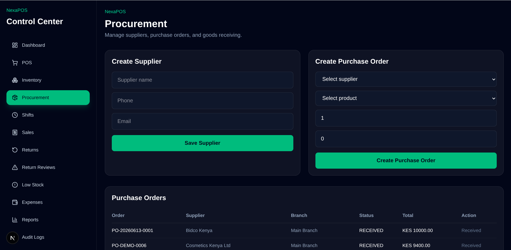
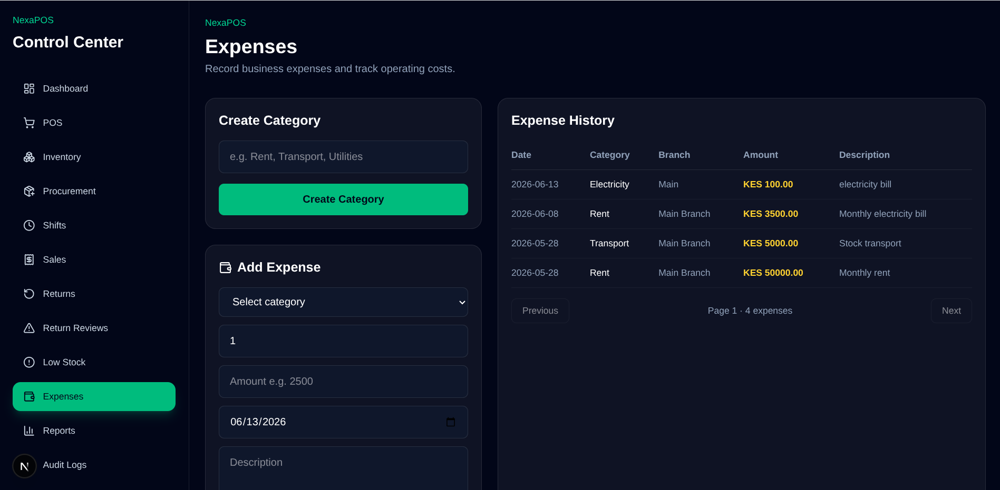
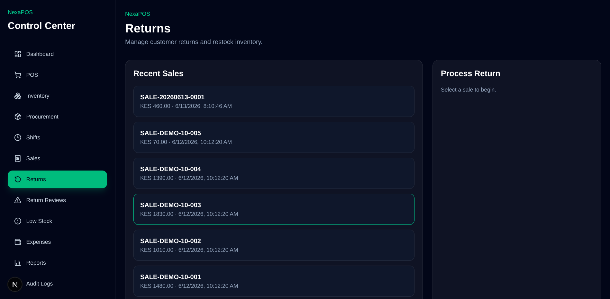
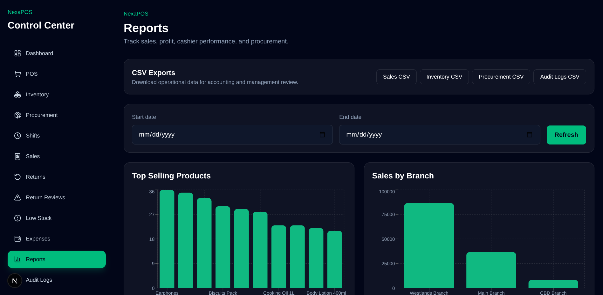

# NexaPOS

Modern multi-branch Point of Sale (POS) and business control system for retail and wholesale businesses.

NexaPOS is a production-minded retail operating system designed to support inventory management, procurement, cashier accountability, expense tracking, returns governance, and real-time business visibility.

Built with a modern full-stack architecture, NexaPOS focuses on practical workflows that growing SMEs actually use every day.

---

## Why NexaPOS?

Many POS systems stop at checkout.

NexaPOS goes further by combining:

- Point of Sale
- Inventory Control
- Procurement
- Expense Management
- Cashier Accountability
- Return Governance
- Operational Visibility

The result is a lightweight business operating system designed specifically for growing businesses.

---

## Screenshots

### Landingpage 2.0

> A clean public-facing landing page with strong positioning, feature cards, and a dashboard-style preview.



---

### Dashboard 2.0

> Real-time business visibility with KPIs, Attention Center, and Recent Activity.



---

### POS Checkout

> Fast retail checkout designed for busy cashiers.



---

### Inventory Management

> Product control, low-stock monitoring, and stock adjustments.



---

### Procurement

> Receive stock, manage purchase orders, and track suppliers.



---

### Expenses

> Record operating expenses and monitor profitability.



---

### Return Reviews

> Serve customers quickly while maintaining fraud controls.



---

### Reports

> View reports on top selling product, top performing branch, top performing cashier.



---

## Product Walkthrough

Watch NexaPOS in action.

> Demo video coming soon.

The walkthrough will demonstrate:

- Login and role-based access
- POS checkout
- Returns processing
- Inventory workflows
- Procurement
- Expense tracking
- Dashboard analytics
- Shift closure

---

## Core Features

### Multi-Branch Management

- Multiple branch support
- Branch-specific inventory
- Branch-level sales tracking
- Staff assignment per branch

### Inventory Management

- Product and category management
- SKU support
- Branch-specific stock levels
- Stock movement tracking
- Low-stock monitoring
- Retail and wholesale pricing
- Product activation and deactivation

### Sales & POS

- Retail checkout
- Wholesale checkout
- Cart-based POS workflow
- Multiple payment methods
- Cashier accountability
- Sales history tracking

### Procurement

- Supplier management
- Purchase orders
- Goods receiving
- Procurement workflows

### Returns & Governance

- Customer returns
- Return reviews
- Risk classification
- Manager approvals

### Expense Management

- Expense categories
- Branch-specific expenses
- Expense tracking and reporting

### Dashboard & Reporting

- Today's sales
- Gross profit
- Expenses
- Net profit estimates
- Attention Center
- Recent Activity Feed

### Audit & Accountability

- Audit logs
- Shift reconciliation
- Cash variance tracking
- User accountability

---

## Role-Based Access Control

NexaPOS supports multiple permission levels:

| Role         | Description                 |
| ------------ | --------------------------- |
| Superadmin   | Full system control         |
| Admin        | Branch and staff management |
| Store Keeper | Inventory and procurement   |
| Cashier      | POS checkout and sales      |

---

## Tech Stack

### Backend

- Python
- Django
- Django REST Framework
- PostgreSQL
- JWT Authentication

### Frontend

- Next.js
- TypeScript
- Tailwind CSS
- Axios
- Lucide React

---

## System Architecture

backend/
├── apps/
│ ├── accounts/
│ ├── audit/
│ ├── branches/
│ ├── expenses/
│ ├── inventory/
│ ├── procurement/
│ ├── reports/
│ └── sales/

---

## Current MVP Scope

### Included

- Authentication
- Multi-branch support
- Inventory management
- POS checkout
- Retail and wholesale pricing
- Procurement workflows
- Returns and return reviews
- Expense tracking
- Dashboard analytics
- Attention Center
- Activity Feed
- Audit logs
- Cashier shift tracking
- Role permissions

### Future Enhancements

- Barcode scanner integration
- Receipt printing
- M-Pesa integration
- Offline support
- Advanced exports and analytics

---

## Dashboard 2.0

NexaPOS provides a business command center designed for shop owners.

### Today's Snapshot

- Sales
- Gross Profit
- Expenses
- Net Profit

### Attention Center

- Critical low stock
- Returns awaiting review
- Open shifts
- Pending purchase orders

### Recent Activity

- Shift closures
- Inventory movements
- Procurement updates
- Return reviews

---

## Pilot Readiness

Current Status:

- ✅ Authentication
- ✅ POS Checkout
- ✅ Inventory
- ✅ Procurement
- ✅ Expenses
- ✅ Returns
- ✅ Dashboard
- ✅ Audit Logs
- ⚠ Session persistence improvements in progress

NexaPOS is currently undergoing end-to-end pilot testing using realistic retail workflows.

---

## Local Development Setup

### Clone Repository

```bash
git clone <repo-url>
cd nexapos
```

### Create Virtual Environment

```bash
python -m venv .venv
source .venv/bin/activate
```

### Install Dependencies

```bash
pip install -r requirements.txt
```

### Configure Environment Variables

Create:

```txt
backend/.env
```

Example:

```env
SECRET_KEY=your-secret-key
DEBUG=True

DB_NAME=nexapos
DB_USER=nexapos_user
DB_PASSWORD=password
DB_HOST=localhost
DB_PORT=5432
```

### Run Migrations

```bash
python manage.py makemigrations
python manage.py migrate
```

### Create Admin User

```bash
python manage.py createsuperuser
```

### Run Server

```bash
python manage.py runserver
```

Visit:

```txt
http://127.0.0.1:8000/admin
```

---

## Project Status

🚀 Active Pilot Preparation

NexaPOS has evolved beyond a simple MVP and is currently undergoing end-to-end testing to prepare for real-world deployment.

---

## License

MIT License
